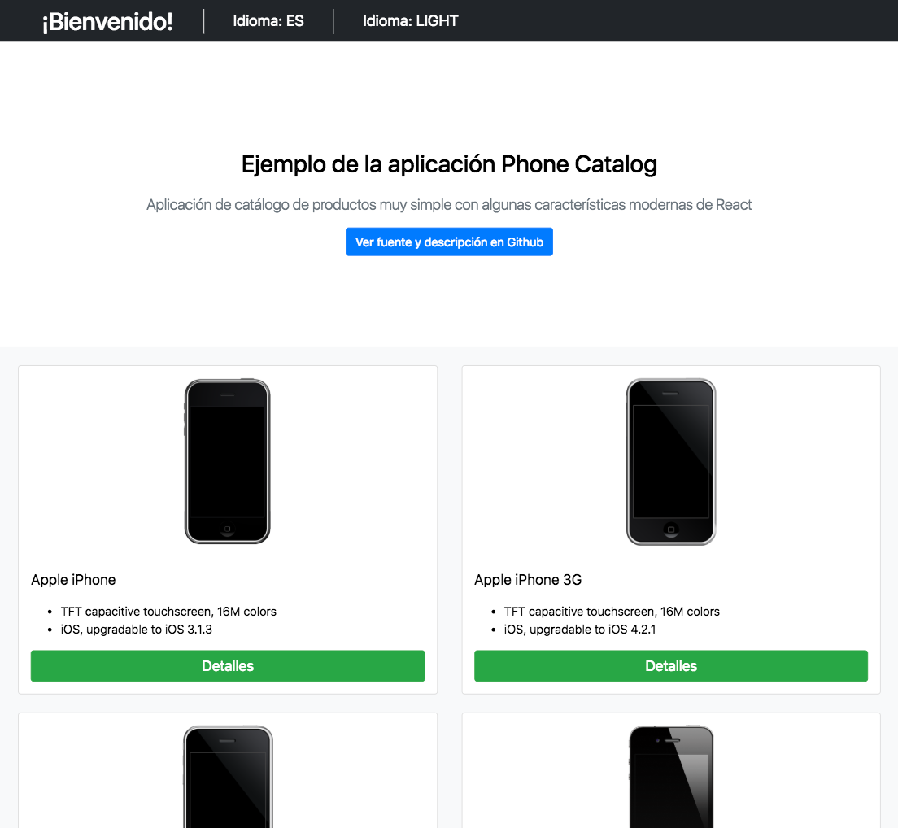

# Masmovil phone catalog app [](https://travis-ci.com/polesskiy-dev/masmovil-phones)

[See Live demo on heroku](https://masmovil-phones.herokuapp.com/)

## Few words about dev features

    [x] Travis CI
    [x] Deploy on Heroku
    [ ] Dockerazing
    [x] Internationalization EN/ES
    [ ] Theme switching
    [x] Responsive
    [x] Unit tests

## About implementation
[react-create-app](https://github.com/facebook/create-react-app) for rapid front-end development with some *eslint airbnb config* enhancement.
[reactstrap](https://reactstrap.github.io/) as a design & components system for fancy look.
I'm not plan to use old bootstrap grid, instead let's utilize modern grids. 

## Client implementation
### Project structure
     
Let's keep component code/styles/tests in folders with appropriate name:
````
└── Popup
    ├── Popup.css
    ├── Popup.js
    └── Popup.spec.js
````

#### common folders
* `helpers` - util functions
* `selectors` - reusable store selectors
* `ducks` - action constants + action creators + reducer + epic combined in duck files 
     
#### components 
* `containners` - connected to store container components
* `layout` - reusable components for page layout e.g. <Footer/>, <Header/>
* `utils` - just reusable components which you can't imagine place

and other folders by business rules, it can be `forms`, `hocs`.

#### styles
* `common-styles` folder

## Code conventions

### file naming

File name should have 
* `PascalCase` if file exports: class, component
* `snake-case` if file exports: function, object, map, list

# Coverage report

Most of the components covered by snapshot unit tests with help of Jest

```
----------------------------------------------------|----------|----------|----------|----------|-------------------|
File                                                |  % Stmts | % Branch |  % Funcs |  % Lines | Uncovered Line #s |
----------------------------------------------------|----------|----------|----------|----------|-------------------|
All files                                           |    27.43 |     4.76 |    21.88 |    35.33 |                   |
 src                                                |        0 |        0 |        0 |        0 |                   |
  epic.root.js                                      |        0 |      100 |      100 |        0 |           1,3,4,6 |
  index.js                                          |        0 |        0 |        0 |        0 |... 25,31,33,35,42 |
  reducer.root.js                                   |        0 |        0 |        0 |        0 |    1,3,4,5,6,8,12 |
  registerServiceWorker.js                          |        0 |        0 |        0 |        0 |... 36,137,138,139 |
 src/components                                     |        0 |        0 |        0 |        0 |                   |
  App.jsx                                           |        0 |        0 |        0 |        0 |... 13,14,15,19,32 |
 src/components/containers/AppMenuHeader            |       80 |      100 |       50 |       80 |                   |
  AppMenuHeader.jsx                                 |       80 |      100 |       50 |       80 |                48 |
 src/components/containers/ConnectedIntlProvider    |        0 |        0 |        0 |        0 |                   |
  ConnectedIntlProvider.jsx                         |        0 |        0 |        0 |        0 |... 5,6,8,13,14,18 |
 src/components/containers/PhoneDetailModal         |      100 |      100 |      100 |      100 |                   |
  PhoneDetailModal.jsx                              |      100 |      100 |      100 |      100 |                   |
 src/components/containers/PhoneListContainer       |    71.43 |       50 |       50 |    71.43 |                   |
  PhoneListContainer.jsx                            |    71.43 |       50 |       50 |    71.43 |             26,33 |
 src/components/hocs                                |       60 |       25 |       40 |       60 |                   |
  withFetchingSpinner.jsx                           |       60 |       20 |       50 |       60 |             15,17 |
  withPhonesSubscribtion.jsx                        |       60 |    33.33 |    33.33 |       60 |             14,18 |
 src/components/presentional/DescriptionJumbotron   |      100 |      100 |      100 |      100 |                   |
  DescriptionJumbotron.jsx                          |      100 |      100 |      100 |      100 |                   |
 src/components/presentional/DetailsButtonComponent |      100 |      100 |      100 |      100 |                   |
  DetailsButtonComponent.jsx                        |      100 |      100 |      100 |      100 |                   |
 src/components/presentional/MenuButton             |       75 |      100 |       50 |       75 |                   |
  MenuButton.jsx                                    |       75 |      100 |       50 |       75 |                 9 |
 src/components/presentional/PhoneCardComponent     |       75 |      100 |       50 |       75 |                   |
  PhoneCardComponent.jsx                            |       75 |      100 |       50 |       75 |                25 |
 src/components/presentional/PhoneDetailComponent   |      100 |      100 |      100 |      100 |                   |
  PhoneDetailComponent.jsx                          |      100 |      100 |      100 |      100 |                   |
 src/components/presentional/Spinner                |      100 |      100 |      100 |      100 |                   |
  Spinner.jsx                                       |      100 |      100 |      100 |      100 |                   |
 src/constants                                      |      100 |      100 |      100 |      100 |                   |
  api.constants.js                                  |      100 |      100 |      100 |      100 |                   |
 src/ducks                                          |    41.18 |        0 |        0 |    43.75 |                   |
  is-fetching-data.duck.js                          |        0 |        0 |        0 |        0 |   1,9,13,15,18,20 |
  language.duck.js                                  |     62.5 |        0 |        0 |     62.5 |          18,20,22 |
  phones.duck.js                                    |    53.33 |        0 |        0 |    53.33 |... 23,24,32,34,38 |
  theme.duck.js                                     |       40 |        0 |        0 |    42.11 |... 32,34,39,41,43 |
 src/helpers                                        |    45.45 |      100 |    33.33 |    45.45 |                   |
  CircleIterator.js                                 |    28.57 |      100 |       25 |    28.57 |    11,12,16,18,22 |
  filter-phones.helpers.js                          |       50 |      100 |        0 |       50 |                 4 |
  with-default-intl.jsx                             |      100 |      100 |      100 |      100 |                   |
 src/selectors                                      |       50 |      100 |        0 |       50 |                   |
  language.selector.js                              |       50 |      100 |        0 |       50 |                 6 |
  phones.selector.js                                |       50 |      100 |        0 |       50 |                 6 |
  spinner.selector.js                               |       50 |      100 |        0 |       50 |                 6 |
  theme.selector.js                                 |       50 |      100 |        0 |       50 |                 6 |
----------------------------------------------------|----------|----------|----------|----------|-------------------|

```

# Some screenshots:

Desktop:


Tablet:



Mobile:

